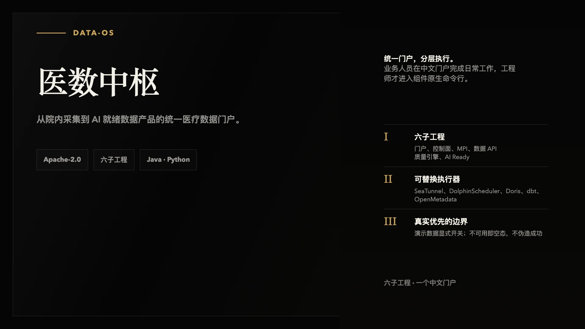
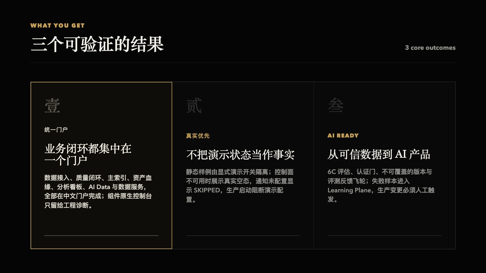

<div align="center">

# data-os（医数中枢）

**医疗数据采集、治理、运营的统一门户**



[](https://github.com/wuxiy/data-os/actions/workflows/ci.yml)
[](./LICENSE)

</div>

---

## 这是什么

医数中枢（data-os）把院内分散的业务数据变成可治理、可追溯、可被 AI 消费的数据产品：HIS / EMR / LIS / 前置机等来源经统一接入链路进入分层数仓，经质量、主索引、元数据与血缘治理成为可信资产，再进一步加工、评测、认证为 AI 就绪数据产品。

底层以 SeaTunnel、DolphinScheduler、Doris、dbt、OpenMetadata、Superset、HAPI FHIR 等开源组件作为可替换执行器；甲方用户只面对统一的中文业务门户，不接触组件原生控制台。

仓库包含六个子工程：

| 子工程 | 职责 | 技术栈 |
| --- | --- | --- |
| `prototype/` | 统一中文门户（13 个桌面路由页面 + 2 条深链） | React 19 + Vite |
| `services/control-plane/` | 控制面：接入、治理闭环、资产血缘 BFF、分析令牌、AI Data、数据服务 | Java 21 / Spring Boot |
| `services/mpi-service/` | 患者主索引：源身份、黄金人、候选审核与合并/拆分 | Java 21 / Spring Boot |
| `services/quality-runner/` | 质量规则执行器：dbt test 引擎与失败证据投影 | Python 3.12 / FastAPI |
| `services/ai-ready-service/` | AI Ready 评估引擎：6C 评估、诊断与修复建议 | Python 3.12 / FastAPI |
| `services/data-api/` | ToB 数据 API 网关：Key、配额与合同事件 | Python 3.12 / FastAPI |

## 为什么需要它

医院数据散落在 HIS / EMR / LIS / 前置机等来源，直接用开源组件原生控制台交付对甲方不可用；治理异常常常追不到数据、规则、责任人和原始证据；AI 应用还需要回答「这份数据是否适合我的场景」。data-os 的取舍是：

- **门户先行**：业务人员在中文门户完成接入、复核、分析和验收；专业人员才进入组件原生控制台诊断。
- **控制面单一事实**：运行状态机、治理问题、通知发件箱与 AI 产品生命周期都在控制面；执行器（SeaTunnel / DolphinScheduler / dbt）可整体替换。
- **真实优先**：演示数据是显式边界，控制面不可用时展示真实空态；未配置的通知通道明确记为 SKIPPED，不把「未配置」伪装成「已送达」。

## 你会得到什么



三件事都已在开发环境跑通：数据接入、质量闭环、主索引复核、资产血缘、分析看板、AI Data 与数据服务串成一条可操作链路；演示数据被显式隔离，不可用即空态；AI Data 域完成 6C 评估（17 项检查）、认证门与数据飞轮，真实 EP 语料首轮检索评测 recall 0.85 → 0.9833、MRR 0.6575 → 0.9208。

## 快速开始

```bash
# 门户原型（React 19 + Vite）
cd prototype
npm install
npm run dev
```

完整开发环境（Compose 覆盖、组件端口与账号）见 `deploy/dev/README.md`；各子工程的测试命令见 `AGENTS.md`；生产部署基线见 `deploy/production/README.md`。生产构建与路由回退要求见 `prototype/README.md`。

## 运行模式与演示数据

门户默认真实模式：未设置 `VITE_DATAOS_DEMO_MODE` 时不渲染任何静态样例，未接入的页面显示待接入边界；控制面运行状态由 `GET /api/v1/system/status` 提供。

控制面运行环境默认按生产处理并关闭演示数据；开发/验收环境如需演示种子和 DEMO 执行器，应显式配置 `DATAOS_RUNTIME_ENV=development`、`DATAOS_SEED_DEMO=true` 和 `DATAOS_QUALITY_DEMO_ENABLED=true`。生产环境设置 `DATAOS_RUNTIME_ENV=production`，控制面启动时会阻断演示配置与历史 FakeSource 任务。详见 `docs/mock-production-readiness.md`。

## 工作方式

门户只访问控制面的版本化业务 API，不直连任何组件；控制面是模块化单体，业务事实落一个 PostgreSQL 控制库，可重试命令携带 `Idempotency-Key`，执行器状态由适配器统一归一回写。控制流、数据流与观测流分离；跨组件状态同步用 PostgreSQL Outbox + 后台 Worker，MVP 不引入消息总线。

配置缺口不会被伪装成成功：未配置 OpenMetadata 时资产/血缘端点为 503；质量执行器地址或通知 Webhook 未配置时，运行状态接口返回告警而不是「已执行 / 已送达」。

动 `controlplane/run/` 或做跨栈抽象前，先读 `docs/agents/architecture.md`（单一来源清单与判断规则）与 `CONTEXT.md`（领域词汇表）。

## 项目现状

- 架构蓝图与技术架构已定稿为实施基线（见下「文档地图」）。
- 门户已完成 13 个桌面路由页面与 2 条深链（资产技术视图、问数工作区）；数据接入、治理驾驶舱、质量闭环、主索引、资产血缘、分析看板、AI Data 与数据服务均已接真实链路。
- 控制面在首条采集切片（数据源、任务、运行、治理闭环、通知发件箱）之外已扩展多个域：凭据服务、OM 资产与血缘只读 BFF、嵌入式分析访客令牌、AI Data Product、ToB 数据服务管理与临床工作流模板；API 面覆盖 `/api/v1/{sources, jobs, governance, credentials, assets, lineage, analytics, ai-data-products, data-services, workflow-templates}`，患者主索引经独立 `mpi-service` 以 `/api/v1/mpi/` 直路由。
- AI Data 域已交付至 G20 验收：6C 检查 17 项、真实 EP 语料全链 SERVING、构建 API 异步任务化（提交返回 202 + 作业轮询）、SERVING 支持撤回再认证。
- 已部署到隔离开发机：门户 `18081`、SeaTunnel `18082`、DolphinScheduler `18083`、Superset 嵌入端口 `18084`、RustFS `19000/19001`；入口与账号查询见 `docs/environment-access-reference.md`。
- 当前阶段为生产化收口（H1–H5 批次）与功能迭代并行，批次纪律见 `AGENTS.md`。

## 文档地图

- `CONTEXT.md`：领域词汇表（外部运行、通知发件箱、质量引擎、运行模式、患者主索引）——评审与设计讨论以其术语为准。
- `AGENTS.md`：工程约定、测试命令与生产化批次纪律。
- `docs/medical-data-platform-blueprint.md`：平台架构蓝图——组件选型、数据分层、门户页面、部署档位、交付路线与安全合规。
- `docs/technical-architecture.md`：技术架构实施基线——控制面模块、组件适配契约、数据与边缘架构、部署、降级和回滚。
- `docs/implementation-plan.md`：20 周 MVP 实施计划——工作包、团队、里程碑、验收门槛、依赖和风险。
- `docs/agents/`：按需阅读的工程边界（架构边界、后端服务、门户前端）。
- `docs/quality-runner.md`：质量执行器跨服务契约（批次号 / 幂等键 / 租约协同）。
- `docs/mock-production-readiness.md`：mock/真实运行模式边界、落地使用方式与验收清单。
- `docs/environment-access-reference.md`：开发环境主机、访问入口、组件账号角色及密码/Token 的受保护查询位置（脱敏，不提交秘密值）。
- `docs/architecture/ai-ready-data.md`：AI Ready Data 架构方案 v1.0（G8 评审通过，已转为实施基线）；实施节奏见 `docs/ai-ready-iteration-plan-20260826.md`。
- `docs/validation/`：各 Gate 的验收证据归档。
- `deploy/dev/`：不含密钥的开发环境 Compose 覆盖；生产基线见 `deploy/production/README.md`。
- `prototype/README.md`：门户路由与数据说明；`DESIGN.md`：第一版原型的视觉设计系统。
- `tasks/`：执行计划与结果复盘（`todo.md`）、经验教训（`lessons.md`）。

## 许可证

[Apache License 2.0](./LICENSE)
