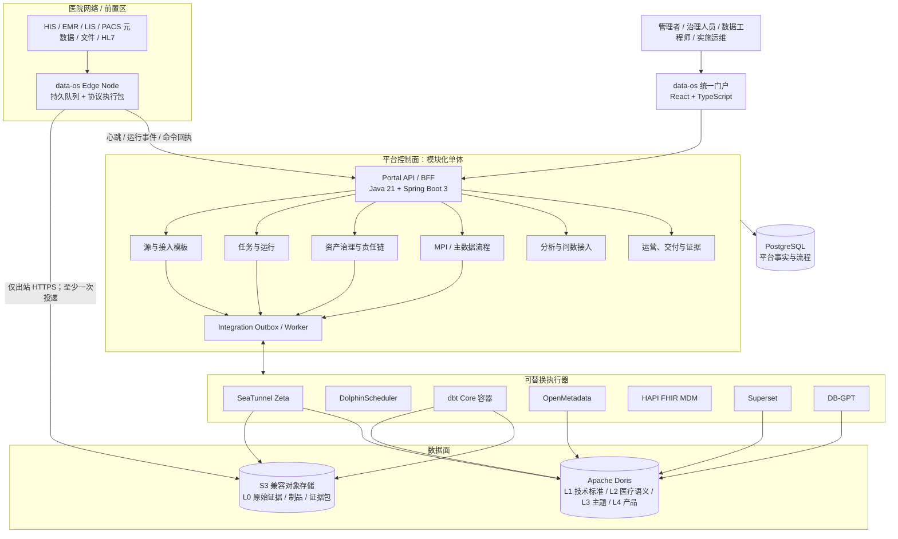
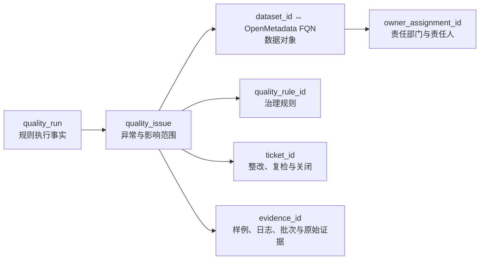
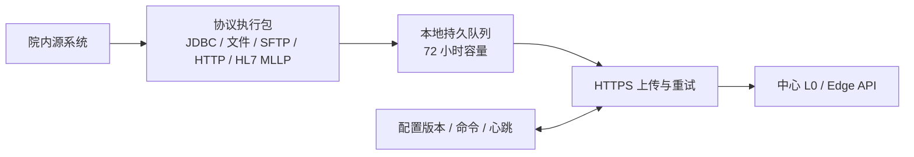

# data-os 技术架构设计

> 版本：1.0
> 日期：2026-08-03
> 状态：实施基线
> 上位文档：[医疗数据采集治理运营平台蓝图](./medical-data-platform-blueprint.md)
> 适用范围：单体医院、区域医疗平台、院内前置机采集

## 1. 架构结论

data-os 采用“统一门户 + 模块化控制面 + 可替换执行器 + 分层数据面”的架构。首期不复制 Databricks 的全量技术栈，也不把多个开源产品的原生界面拼成门户。

实施基线如下：

- 门户：React + TypeScript，只依赖 data-os BFF，不直接访问组件内部 API 或数据库。
- 控制面：Java 21 + Spring Boot 3 的模块化单体；先保持一个部署单元和一个 PostgreSQL 控制库，模块通过领域接口隔离，不在 MVP 拆微服务。
- 身份入口：复用 data-ops 已验证的 Keycloak，以 OIDC 接入 data-os；组件服务账号和嵌入令牌只能由后端适配器持有。
- 中心采集：Apache SeaTunnel Zeta；DolphinScheduler 负责任务依赖、补数、重跑和调度历史。
- 数据工程：Apache Doris 承接 L1—L4，S3 兼容对象存储承接 L0 原始证据；dbt Core + dbt-doris 承接批量/微批 SQL 转换和构建门禁。
- 治理：OpenMetadata 承接资产、术语、技术血缘和质量结果；标准、映射、问题、责任链和审批事实归 data-os 控制库。
- MPI/MDM：HAPI FHIR R4 + MDM 承接医疗资源和匹配链接；data-os 承接候选审核、黄金值、合并/拆分、版本和发布。
- 分析与问数：Superset 通过 Embedded SDK 接入，DB-GPT 通过后端适配器接入；二者都不直接成为业务门户。
- 边缘：data-os Edge Node 作为统一产品壳，按站点启用文件/JDBC/HTTP/SFTP 或 HL7 v2/MLLP 执行包；NiFi 服务端不进入默认部署。
- 组件间状态同步：MVP 使用 PostgreSQL Outbox + 后台 Worker，不引入 Kafka；达到区域规模和明确吞吐门槛后再引入消息总线。

## 2. 目标、约束与非目标

### 2.1 目标

1. 单院与区域平台共用一套代码，差异由租户、机构和能力包配置表达。
2. 甲方人员在统一门户完成日常接入、治理、复核、分析和验收，专业人员才进入原生控制台诊断。
3. 一条治理异常可追到数据、规则、责任人、工单和原始证据；一项指标可追到口径、模型和源数据集。
4. 标准院内数据源能通过模板快速交付，常规运维不依赖登录服务器、修改 YAML 或直接操作底层组件。
5. 开发、PoC、生产使用同一套配置语义和兼容性 BOM，支持离线安装、升级和回滚。

### 2.2 首期约束

- 团队按 4—6 人设计；组件数量必须受控，优先复用 data-ops 已验证的 Doris、Keycloak、部署和灾备资产。
- 医院网络、数据库权限、日志权限和协议样本决定接入能力，不能用平台设计替代厂商授权。
- 安全合规暂不作为 PoC 主验收范围，但 `tenant_id`、`institution_id`、审计字段和可逆变更从第一天保留。
- 前端仅面向 1280px 以上桌面端；本阶段不建设移动端布局。

### 2.3 首期非目标

- 不建设 Spark、Flink、Kafka、Trino、Iceberg 的完整大数据集群。
- 不建设通用低代码 ETL 设计器、Notebook、模型训练和特征平台。
- 不替换 HIS、EMR、PACS/VNA，不保存 DICOM 像素主体。
- 不承诺所有异构源的绝对 exactly-once；采用至少一次、稳定幂等键、发布前对账。
- 不让 data-os 复制 Superset 图表、OpenMetadata 目录、DolphinScheduler 调度器或 HAPI FHIR 匹配引擎。

## 3. 总体架构



控制流、数据流和观测流必须分开：

- 控制流：门户创建版本化配置，适配器把“期望状态”发布给执行器。
- 数据流：源数据只向 L0—L4 和数据产品方向推进，不从数仓反写源系统。
- 观测流：组件运行状态、指标和错误由 Worker 归一后写回控制库。

## 4. 控制面设计

### 4.1 为什么采用模块化单体

MVP 的业务复杂度主要来自领域和外部组件，而不是独立扩缩容。模块化单体能让小团队用一个部署单元完成事务、权限上下文、审计和离线交付，同时通过模块接口保持未来拆分能力。以下情况出现前不拆微服务：

- 某模块需要独立扩缩容且已成为明确瓶颈；
- 两个团队需要独立发布并拥有不同发布节奏；
- 单模块故障已多次影响整个控制面，且进程内隔离无法解决。

### 4.2 领域模块与事实归属

| 模块 | 负责的业务事实 | 对外能力 | 不负责 |
|---|---|---|---|
| organization | 租户、机构、院区、主题域 | 范围树、机构上下文 | 用户认证实现 |
| source | 源系统、连接、凭据引用、采集模板、Edge Node | 接入向导、连接测试、模板版本 | 执行采集 |
| orchestration | 任务定义、发布版本、运行投影、补数申请 | 发布、启动、暂停、重试、补数 | 保存调度器完整内部模型 |
| governance | 标准、映射、质量规则、数据合同、问题、责任链 | 评审、发布、复检、指派、关闭 | 保存大规模数据明细 |
| catalog | data-os 对资产、血缘、质量结果的统一投影 | 搜索、资产详情、影响分析 | 成为第二套元数据中心 |
| masterdata | MPI 候选、黄金值、crosswalk、机构/科室/人员主数据 | 确认、拒绝、合并、拆分、发布 | 自研通用概率匹配框架 |
| analytics | 看板绑定、指标口径引用、嵌入会话 | 获取嵌入令牌、看板目录 | 复制 Superset 图表模型 |
| assistant | 问数会话、查询边界、证据引用、反馈 | 问答流、SQL 证据、反馈 | 直接向浏览器暴露数据库或模型密钥 |
| operations | 告警、SLO、诊断、交付证据包 | 健康总览、诊断包、验收导出 | 替代 Prometheus 指标采集 |
| integration | 执行器适配器、Outbox、重试、状态归一 | 稳定的内部端口 | 把厂商对象泄漏给领域模块 |

模块之间只通过应用服务、领域事件和稳定 ID 引用。禁止跨模块直接修改表；读模型可以通过只读视图组合。

### 4.3 核心 ID 与责任链来源

所有跨组件对象使用 data-os 生成的不可变 UUID，外部组件 ID 只保存为映射：

```text
tenant_id / institution_id
source_id / connection_id / edge_node_id
ingestion_job_id / job_version_id / run_id / ingest_event_id
dataset_id / external_asset_fqn
standard_id / mapping_id / quality_rule_id / quality_run_id
issue_id / owner_assignment_id / ticket_id
mpi_case_id / golden_record_id / mpi_link_version
dashboard_binding_id / assistant_query_id / evidence_id
```

治理驾驶舱中的“责任链”不是推测产生，数据来源固定如下：



- 资产与技术负责人来源：OpenMetadata，经 `dataset_id ↔ FQN` 映射同步。
- 责任部门、规则责任人和生效周期来源：data-os 治理注册库的版本化责任分配。
- 问题状态、SLA、处理记录和复检结果来源：data-os 控制库。
- 规则运行结果来源：dbt `run_results.json` 或平台质量执行器，统一映射到 `quality_run_id`。
- 原始证据来源：`ingest_event_id → raw_object_uri + checksum`。

任一链路缺少来源映射时，界面必须显示“来源未登记”，不得自动填充虚构责任人。

### 4.4 Portal API 边界

前端只访问版本化业务 API：

| API 前缀 | 用途 |
|---|---|
| `/api/v1/sources`、`/connections`、`/edge-nodes` | 接入和前置节点 |
| `/api/v1/jobs`、`/api/v1/jobs/{id}/status`、`/api/v1/jobs/{id}/config`、`/runs`、`/backfills` | 任务生命周期、版本化配置、运行、补数 |
| `/api/v1/sources`、`/api/v1/sources/{id}/check` | 数据源登记和 JDBC/HTTP/FHIR 可用性检查 |
| `/api/v1/assets`、`/lineage` | 资产与血缘统一投影 |
| `/api/v1/standards`、`/mappings`、`/quality`、`/issues`、`/governance/sla/scan`、`/governance/issues/{issueId}/notifications/remind`、`/governance/notifications/deliver` | 治理闭环、SLA 和责任人通知 |
| `/api/v1/mpi`、`/master-data` | 主索引与主数据 |
| `/api/v1/analytics` | Superset 看板目录和嵌入会话 |
| `/api/v1/assistant` | DB-GPT 问答、证据和反馈 |
| `/api/v1/system/status` | 非敏感运行模式、执行器配置和降级告警 |
| `/api/v1/operations`、`/evidence` | 运营和交付证据 |
| `/edge/v1/heartbeat`、`/events`、`/artifacts`、`/commands` | Edge Node 出站通信 |

所有可重试的运行、发布和补数命令携带 `Idempotency-Key`；当前首条采集切片已在运行命令落地按任务维度的幂等重放。异步操作返回 `operation_id`，前端订阅 SSE 状态或轮询统一操作接口，不等待底层任务执行完成。

门户静态原型数据不是业务事实。默认真实构建不渲染未接入服务的样例，只有显式设置 `VITE_DATAOS_DEMO_MODE=true` 才启用脱敏/合成演示数据；控制面 API 失败不得静默回退到问题、指标或责任链 mock。门户通过 `/api/v1/system/status` 展示 LIVE/DEMO、执行器配置和通知通道告警。控制面 `DATAOS_RUNTIME_ENV` 默认按 production 处理，显式标记 production 时会阻断演示种子、DEMO 质量执行器及历史 FakeSource 采集任务。

### 4.6 采集任务配置契约（首条切片）

采集任务定义与运行输入分离：`ingestion_jobs` 保存业务名称、来源、模式和执行器，`ingestion_job_configs` 保存当前生效的 `template_key`、`template_version`、结构化 JSON 与更新时间。门户创建任务或编辑任务配置时只调用控制面 API，控制面返回 `configured` 投影供页面决定是否允许启动。

当前配置最小校验规则：

- `env` 必须为对象；`source` 与 `sink` 必须为非空数组；`template_version >= 1`。
- 结构 JSON 只表达连接器和转换参数，不保存真实密码、Secret 或 Token。配置中递归出现包含 `password`、`secret` 或等于 `token` 的键，统一返回 `400 INVALID_REQUEST`。
- 运行请求体为空时，适配器读取任务已保存配置；请求显式带配置时只用于本次运行，不覆盖任务版本。
- `Idempotency-Key` 在同一任务内最多 128 个字符；控制面保存规范化运行配置的 SHA-256 指纹，相同 key 且指纹一致时返回已存在运行记录，指纹不一致返回 `409 CONFLICT`，避免浏览器重试造成重复提交或静默忽略新配置。

首期模板采用 `FAKE_TO_CONSOLE`（用于验收）和 `CUSTOM_JSON` 两类入口。院内 JDBC/HTTP/SFTP/HL7 连接器在拿到脱敏样本和凭据引用后，以新增模板版本接入，不修改运行 API。

### 4.7 任务生命周期与来源检查契约

- `ingestion_jobs.status` 是任务生命周期事实，当前支持 `DRAFT`、`ACTIVE`、`PAUSED`、`ARCHIVED`；`job_runs.status` 只表示某一次执行结果。控制面启动运行时会把草稿任务提升为 `ACTIVE`，暂停和归档任务返回 `409 CONFLICT`，不创建运行占位记录。
- `POST /api/v1/jobs/{jobId}/runs/{runId}/retry` 只接受 `FAILED`、`CANCELED`、`BLOCKED_CONFIGURATION`、`BLOCKED_DEPENDENCY`、`SUBMIT_FAILED` 和 `UNSUPPORTED_EXECUTOR` 等终态；重试生成新的运行 ID 和幂等键，重新使用任务已保存配置，原运行记录保持不可变。
- 数据源检查通过 `SourceCheckAdapter` 端口隔离协议差异。JDBC 适配器使用请求内的临时连接参数建立短连接，HTTP/FHIR 适配器只执行受控健康请求；密码不写入 `sources` 表。检查调用不持有数据库事务，完成后仅以一次短更新回写 `status`、`last_checked_at` 和 `last_check_message`。
- 适配器无法支持的协议返回 `BLOCKED_CONFIGURATION`，网络/认证失败返回 `UNHEALTHY`；门户必须显示结果与时间，不能把“待检查”渲染为“健康”。

### 4.5 身份与会话最小基线

- data-os 门户使用 OIDC Authorization Code + PKCE 接入 Keycloak；浏览器只持有 data-os 用户会话，不持有外部组件服务账号。
- BFF 将用户角色归一为管理、治理、技术、业务四类工作台权限；细粒度授权和等保设计不进入 PoC 主范围。
- Superset、OpenMetadata、DB-GPT、HAPI FHIR 的服务账号由对应 Adapter 使用，组件 token 不向前端透传。
- 用户、租户和机构上下文在 Portal API 边界确定，执行器不能自行决定跨机构可见范围。

## 5. 执行器集成契约

### 5.1 通用适配器端口

控制面只依赖以下内部端口：

```text
ConnectorAdapter: validate / render / publish / test
OrchestratorAdapter: deployWorkflow / start / pause / retry / backfill / getRun
MetadataAdapter: search / getAsset / getLineage / upsertOwnership / ingestArtifacts
MasterDataAdapter: match / queryLinks / confirm / reject / merge / split
AnalyticsAdapter: listDashboards / issueEmbedSession
AssistantAdapter: ask / cancel / getEvidence / feedback
```

每个适配器必须提供：能力声明、健康检查、超时、幂等键、错误码映射、重试策略和兼容版本。领域层不得出现 SeaTunnel job JSON、OpenMetadata Entity、Superset Guest Token 或 HAPI FHIR 内部表结构。

### 5.2 SeaTunnel 与 DolphinScheduler

- SeaTunnelAdapter 将版本化接入配置渲染为 JSON/HOCON，通过 REST API V2 提交、停止、查询作业和检查点；生产不依赖页面模拟操作。
- 当前首条垂直切片已落地 SeaTunnel 提交与运行查询：控制面通过 `/job-info/{jobId}` 将 `SUBMITTED/RUNNING/FINISHED/FAILED/CANCELED` 归一为平台运行状态，并保留外部开始/结束时间。
- DolphinScheduler 是 DAG、计划、补数和运行历史的权威来源；data-os 保存业务投影和外部工作流映射。
- `DolphinSchedulerExecutorAdapter` 已接入控制面执行器端口。Gate 1 采用已发布工作流绑定：任务配置的 `dolphinscheduler.projectCode` 与 `workflowDefinitionCode` 只引用经过审核的工作流，控制面通过 `/projects/{projectCode}/executors/start-workflow-instance` 启动实例，再通过 `/workflow-instances/{id}` 查询状态；`process-instances` 仅作为旧版兼容路径。外部编号采用 `ds|project|workflow|instance`，并把 data-os 运行 ID 放入 `startParams.dataos_run_id`。公开实例列表 API 不能按该启动参数做可靠唯一查询，因此提交响应超时时控制面进入 `BLOCKED_DEPENDENCY` 而不自动重试；必须先人工对账，exactly-once 对账列为 Gate 1 P1。
- DolphinScheduler 访问凭据只来自运行环境的专用 token，或由专用服务账号登录后缓存的 `sessionId`；任务 JSON 不得携带密码、Token 或 Secret。DolphinScheduler 原生 UI 只用于技术人员诊断，甲方日常使用 data-os 门户。
- 单院开发/交付基线使用 `deploy/dev/dolphinscheduler/docker-compose.yml`：API、Master、Worker、Alert、独立 PostgreSQL 和幂等 JDBC Registry 迁移，默认不启用 ZooKeeper；API 仅作为内网控制面依赖，生产不映射公网。区域部署再扩 API/Master 和 Worker group，不能把单院 JDBC Registry 方案直接当作区域高可用方案。
- 当前 SeaTunnel Zeta REST 直连仍保留为开发兼容执行器；DolphinScheduler 内置 `SEATUNNEL` 节点是 Worker 本地 CLI 包装器，不会自动调用已有 SeaTunnel REST。若要纳入 DS 工作流，首期使用受控 HTTP/Shell 节点或后续专用任务插件，禁止误把两种执行语义混用。
- 标准流程为 `L0 证据确认 → L1 装载 → dbt build → 质量结果 → OpenMetadata 摄取 → 数据产品发布`。
- Portal 发布任务时先落库和 Outbox，再由 Worker 发布到执行器；发布失败不改变上一个生效版本。
- 状态同步采用控制面后台增量轮询，同时提供 `POST /api/v1/jobs/{jobId}/runs/{runId}/sync` 供门户人工刷新；本轮使用 PostgreSQL 运行表直接回写，连续依赖失败保留可重试状态，配置型状态查询失败转为 `FAILED`，`UNKNOWN` 只允许人工重试，后续接入 Outbox/死信表时不改变适配器契约。任务生命周期状态与最近一次运行状态分离，后者以 `job_runs` 为准。
- 开发档位限制单控制面实例与每轮最多 100 条候选；进入区域多副本前必须替换为数据库租约/`SKIP LOCKED`、`next_sync_at` 退避和并行 worker，避免重复查询与长尾饥饿。
- 质量复检使用独立 `QualityRuleExecutor` 端口：控制面先持久化 `quality_rule_runs` 执行批次，再在事务外调用 `HTTP/DBT` 适配器，后台轮询并回写 `status/passed/execution_batch_id/sample_evidence`。`SUBMITTING` 也属于可恢复扫描态；提交阶段使用数据库租约和 worker 所有权，临时执行器不可用时保留该态并指数退避，执行批次号作为外部执行器 `Idempotency-Key`。人工同步对 `SUBMITTING` 遵守下次投递时间，只触发状态轮询，不会绕过投递退避。`SUCCEEDED + passed=true` 触发 `AUTO_CLOSED`，失败、取消或未通过触发 `AUTO_RETURNED/RECHECK_FAILED`；所有流转均通过条件更新和事件表保证幂等，详情同时返回最近批次和历史批次（最近 20 条）。开发环境可用确定性的 `DEMO` 适配器跑通交付验收，但必须显式设置 `DATAOS_QUALITY_DEMO_ENABLED=true`；生产应替换为 dbt、Great Expectations 或院内质量服务并关闭 DEMO。
- SLA worker 扫描 `due_at`，在 `sla_overdue_at` 首次写入时生成 `SLA_OVERDUE` 事件；复检中的问题不被强制改成逾期状态，避免覆盖执行态。责任人通知以 `WEBHOOK` 适配器为第一通道，通知表保存幂等键、尝试次数、退避时间、租约和最终状态；投递前通过条件更新抢占 `SENDING`，完成时校验 worker，避免定时任务与人工接口并发外发。未配置通道时显示 `SKIPPED`，不得伪造送达事实；门户主动提醒也复用该队列，关闭问题拒绝提醒，同一 `Idempotency-Key` 不重复生成事件或通知。

### 5.3 dbt、Doris 与 OpenMetadata

- dbt 项目是 L1—L4 SQL 模型、依赖和构建期测试的代码事实源；以 Git tag 和不可变容器镜像发布。
- DolphinScheduler 运行固定镜像的 `dbt build`。`manifest.json`、`catalog.json`、`run_results.json` 和日志写入对象存储。
- OpenMetadata 在 dbt 完成后摄取制品，形成模型、字段、血缘和测试结果；data-os 只保存业务 ID 映射和面向门户的短期读缓存。
- Doris L1 当前态表默认使用 Unique Key；乱序 CDC 使用业务版本或序列列判定新旧。L0 事件与审计明细使用保留重复事实的模型。
- 每次批次装载使用稳定 label/批次 ID，重试前先核对提交结果；L2 以后只消费已写入证据清单的批次。

### 5.4 Superset

- 前端使用 `@superset-ui/embedded-sdk` 嵌入已登记的 dashboard UUID。
- 浏览器调用 data-os `/api/v1/analytics/dashboards/{id}/session`；BFF 使用服务账号向 Superset `/api/v1/security/guest_token/` 换取短期 Guest Token。
- Token、服务账号和数据库凭据不进入浏览器。门户只保存 `dashboard_binding_id ↔ Superset dashboard UUID`、业务目录、口径引用和可见范围。
- Superset 不可用时，门户保留看板目录、最近成功时间和口径说明，并显示“分析服务暂不可用”；不影响采集、治理和 MPI。

### 5.5 OpenMetadata

- 日常资产搜索、详情、血缘和质量结果由 MetadataAdapter 调用 OpenMetadata API；常用聚合可在控制库保存有时效标识的投影。
- 标准、映射审批、问题工单仍在 data-os；发布后把术语、标签、Owner、Contract 引用同步到 OpenMetadata。
- OpenMetadata 不可用时，元数据同步事件进入 Outbox，数据采集和模型构建继续；门户明确显示资产元数据的最后同步时间。
- 禁止两个系统都成为同一事实的编辑入口。资产 Owner 以 OpenMetadata 为准，治理责任分配以 data-os 为准。

### 5.6 DB-GPT

- AssistantAdapter 调用 DB-GPT 数据问答 API，BFF 负责会话上下文、流式转发、取消、超时和错误归一。
- DB-GPT 只连接只读数据集或受控语义视图；默认禁止 DDL/DML、多语句、无界明细和跨租户查询。
- 每次回答必须返回 `assistant_query_id`、使用的数据集、指标口径、生成 SQL、执行耗时、最大数据时间和结果截断说明。
- DB-GPT 或模型服务不可用时，智能问数降级为资产/指标检索；不影响固定看板和数据服务。
- DB-GPT 是实验性消费能力，不进入采集、质量、MPI 或发布的关键路径。

### 5.7 HAPI FHIR MDM

- Patient、Practitioner、Organization 等医疗主数据使用 FHIR R4 表达；HAPI MDM 提供规则匹配、Golden Resource 和 MATCH/POSSIBLE_MATCH/NO_MATCH 链接。
- data-os 保存审核任务、字段 survivorship、操作者、影响预览、发布版本和撤销事件，并调用 HAPI MDM 操作变更链接。
- 原始临床事实只追加 `mpi_link_version`，不因黄金记录变化覆盖源患者 ID。
- 匹配引擎不可用时，数据进入待匹配区；禁止生成临时区域身份绕过审核。

### 5.8 数据服务

- 数据服务定义、参数、数据合同、责任人和版本归 data-os；可执行查询来自已发布的 L4 视图或 dbt model，不在门户维护任意 SQL。
- 同步查询只允许参数化 `SELECT`，设置 statement timeout、最大行数和返回大小；大结果集转为异步导出并写入对象存储。
- API 调用记录 `data_product_id`、版本、调用方、run ID、数据最大时间和结果摘要，能回到资产、口径和模型版本。
- 数据服务与 DB-GPT 共用只读语义视图，但使用独立账号和配额；问数失败不能影响正式 API。

## 6. 数据架构

### 6.1 分层与表模型

| 层 | 权威存储 | 内容 | 发布门槛 |
|---|---|---|---|
| L0 原始证据 | 对象存储 | 原始消息、文件、快照、CDC envelope、清单、checksum | 对象和清单提交成功 |
| L1 技术标准 | Doris | 类型、时间、编码、主键、删除标志和源字段规范化 | 与 L0 批次对账通过 |
| L2 医疗语义 | Doris | 标准映射、值域、MPI crosswalk、FHIR/医疗语义 | dbt build 与关键质量门禁通过 |
| L3 主题 | Doris | 患者、就诊、医嘱、检验、检查、费用、手术、护理 | 主题合同和血缘发布完成 |
| L4 产品 | Doris / API / 文件 | 指标、标签、患者 360、监管专题、看板数据集 | 口径、责任人、SLA 和消费方登记 |

### 6.2 最小追溯字段

每条 L1—L4 事实必须直接携带或可一跳关联：

```text
tenant_id, institution_id, source_system_id
source_record_id | message_id
ingest_event_id, source_offset | source_version
raw_object_uri, raw_checksum
event_time, ingest_time
mapping_version, model_version, mpi_link_version
```

### 6.3 L0 提交协议

1. 采集端生成稳定 `ingest_event_id`，上传临时对象。
2. 中心校验大小与 checksum，将对象转为已提交状态。
3. 写入不可变 manifest，登记源偏移、对象 URI、批次行数和 schema 指纹。
4. 中心返回确认；Edge Node 收到确认后才清理本地队列。
5. L1 装载引用 manifest；重复事件由 `ingest_event_id` 和目标表幂等键消除。
6. L0 或 manifest 不完整时，L2—L4 不得发布。

### 6.4 Schema 变更

- 增列：兼容性评估通过后自动生成候选版本，默认不自动发布到 L2+。
- 删列、改类型、改主键：标记破坏性变更，输出下游数据集、规则、API 和看板影响清单后审批。
- 生产转换不原地覆盖旧定义；新表/新版本构建成功后通过逻辑视图或别名切换。
- 任一版本保留源 schema 指纹、映射版本、dbt tag 和回滚目标。

## 7. 边缘与前置机架构

### 7.1 Edge Node 结构



- Edge Node 首期采用 Java 21 无界面服务，与控制面共享协议模型；安装包内置运行时，Windows 服务和 Linux systemd 使用同一配置模型，甲方不需要单独安装开发环境。
- 本地队列使用 SQLite WAL 保存状态、偏移、checksum 和重试元数据，数据正文进入按批次分目录的文件 spool；不把大文件或消息正文写成 SQLite BLOB。
- Edge Node 只主动出站，执行包按站点安装，不默认叠装 MiNiFi、OIE 和自研适配器。
- 默认插件优先复用成熟库：JDBC/文件/HTTP/SFTP 使用受控连接器，HL7 v2/MLLP 使用 HAPI HL7/Camel 库；需要可视化边缘流或既有 MiNiFi 资产时才启用 MiNiFi 能力包。
- 每个队列项保存偏移、重试次数、checksum、首次/最近失败原因和下一次重试时间。
- 磁盘到 70% 告警、85% 限速、95% 停止继续读取可回放源；不可回放源必须在项目验收前给出专用策略。

### 7.2 幂等键

| 来源 | 默认幂等键 |
|---|---|
| HL7 v2 | `tenant + source + MSH-10 + message_type` |
| 数据库 | `tenant + table + primary_key + change_version` |
| 文件 | `tenant + normalized_path + size + checksum` |
| DICOM 元数据 | `tenant + SOPInstanceUID + checksum` |

无稳定主键、无日志位点或无法重复读取的源，必须在接入模板中标为“受限语义”，并用批次对账和人工补偿验收，不能声明无重复结果。

## 8. 部署架构

### 8.1 环境形态

| 环境 | 运行形态 | 用途 |
|---|---|---|
| 本地开发 | Docker Compose + mock adapter | 门户、控制面、领域测试；不要求每位开发者运行所有重组件 |
| 集成/PoC | 单台 Linux + Compose；Edge Node 独立 | 1 院、10—20 表、端到端垂直切片 |
| 单院生产 | 单节点 K3s + 外部备份，或有 HA 合同直接 3 控制节点 | 10—20 系统、100—300 表 |
| 区域试点 | 3 控制节点 + 可扩 worker；每院独立 Edge Node | 5—20 院、机构隔离和模板复用 |

### 8.2 推荐起步资源

- 完整 PoC：16 vCPU、64 GB RAM、1 TB SSD；Edge Node 4 vCPU、8 GB RAM，磁盘按 72 小时峰值计算。
- 单院生产：控制面 8 vCPU/32 GB；无 HA 合同时可复用已验证的 data-ops Doris 集群，或使用单 FE/BE 并明确为非 HA；有 HA 合同时使用 3 FE 和跨至少 3 BE 的数据副本。对象存储和备份容量按原始日增量、保留周期和 30% 余量计算。
- 两节点不包装为高可用。甲方要求控制面 HA 时采用 3 节点或接入现有 Kubernetes。

最终容量不是固定规格：P0 必须用源表数、日增量、峰值、保留周期、Doris 查询并发和 72 小时边缘积压计算并由技术负责人签字。

### 8.3 发布与配置

- 一份 BOM 固定组件版本、镜像摘要、连接器和已通过的组合；禁止生产直接使用 `latest`。
- Compose 与 Helm 共享同一配置 schema；差异仅限副本、存储类、域名和资源配额。
- 数据库迁移使用 expand-and-contract；破坏性迁移先加新结构、回填、双读验证，再切换和删除旧结构。
- `platformctl` 提供 preflight、install、status、backup、restore、upgrade、rollback、diagnose。
- 离线交付包含镜像、制品、SBOM/许可证清单、checksum、安装记录和回滚包。

## 9. 可观测性与运行目标

MVP 使用 Micrometer/Prometheus 指标和 Grafana；应用日志输出结构化 JSON，由 journald/容器日志按保留策略收集。区域化后日志量达到门槛再引入 Loki/OpenTelemetry，不在首期默认增加组件。

| 指标 | MVP 目标 |
|---|---:|
| 标准源首表接入中位时长 | ≤30 分钟 |
| 安装到可用 | ≤60 分钟 |
| 标准日常运维在门户完成 | ≥90% |
| 任务失败/延迟被门户感知 | ≤5 分钟 |
| 前置离线缓存 | 72 小时 |
| 恢复后追平速度 | ≥日常产生速度 2 倍 |
| 控制库 RPO / RTO | ≤15 分钟 / ≤4 小时 |
| 5 名技术 + 3 名业务用户任务成功率 | ≥90% |

关键指标必须同时带 `tenant_id`、`institution_id`、组件、任务和 run ID 标签；禁止使用患者标识作为监控标签。

## 10. 故障降级与恢复

| 故障 | 正常降级 | 禁止行为 | 恢复动作 |
|---|---|---|---|
| Edge 与中心断网 | 本地缓存、告警、恢复补传 | 静默丢弃 | 从最后确认位点续传并对账 |
| SeaTunnel/worker 失败 | 保留 L0 和检查点，任务可重试 | 直接跳到 L2 发布 | 从检查点/批次重跑 |
| 对象存储不可用 | 采集背压或进入边缘队列 | 绕过 L0 直接发布 | 恢复上传、manifest 对账后继续 |
| OpenMetadata 不可用 | 采集、dbt 继续；元数据事件排队 | 把缓存投影当实时事实 | 重放 Outbox、刷新同步时间 |
| Superset 不可用 | 显示目录、口径和最近成功时间 | 阻塞治理与交付 | 服务恢复后重新签发嵌入会话 |
| DB-GPT/模型不可用 | 降级到指标和资产检索 | 返回无证据的编造回答 | 取消未完成查询，恢复后新建请求 |
| HAPI FHIR MDM 不可用 | 进入待匹配区 | 临时生成不可追溯黄金 ID | 重放待匹配任务 |
| DolphinScheduler 不可用 | 已运行作业按执行器能力继续 | 门户伪造“成功”状态 | 对账实例并恢复业务投影 |
| 门户控制面不可用 | 已落地工作区显示真实不可用状态；静态模块不渲染样例 | 用 mock 问题/指标冒充实时事实 | 恢复 `/api/v1` 后重新加载 |

Outbox 重试采用有上限的指数退避；超过阈值进入死信队列，由运营中心显示责任组件、影响对象、首次失败时间和一键重放入口。

## 11. 扩展、10 倍规模与回滚

### 11.1 10 倍规模

10 倍规模下优先出现瓶颈的是 Edge 磁盘、SeaTunnel worker、Doris compaction、调度并发和 OpenMetadata 索引，而不是门户。扩展顺序固定为：

1. 按机构拆分 Edge 队列和上传并发。
2. 扩 SeaTunnel worker 和 DolphinScheduler worker group。
3. 按主题/机构分区并扩 Doris BE，校验 compaction 和热点 key。
4. 降低非关键元数据采集频率，分批摄取 dbt 制品。
5. 区域数据达到数十 TB、出现多引擎读取或冷数据成本压力时，启用 Iceberg 能力包。
6. 只有 Outbox 无法满足事件吞吐、保留和消费者隔离时，才引入 Kafka/Redpanda，并保持领域事件契约不变。

### 11.2 回滚

- 应用/组件：回到上一 BOM 和 Helm revision。
- 采集配置：恢复上一 `job_version_id`，新旧版本使用不同外部工作流映射。
- 数据模型：恢复上一 dbt tag，以 L0 证据重建新表后切换别名。
- 标准/映射：撤回当前版本，重新构建受影响 L2+，不修改历史证据。
- MPI/MDM：以事件撤销链接或拆分黄金记录，下游继续保留历史 `mpi_link_version`。
- 错误方向：控制面适配器和稳定领域 ID 保持不变，可替换 SeaTunnel、OpenMetadata、Superset、DB-GPT 或匹配引擎，而无需重写门户。

## 12. 决策门与不可提前承诺项

| 决策门 | 负责人 | 截止 | 通过标准 | 不通过时 |
|---|---|---|---|---|
| 首院源与权限可用 | 实施负责人 | W1 第 3 天 | 1 个数据库、1 个前置协议拿到脱敏样本和真实权限 | 停止工期承诺，形成厂商依赖清单 |
| BOM 兼容性 | 技术负责人 | W2 末 | SeaTunnel→Doris、dbt-doris、OM dbt 摄取、Superset 嵌入、HAPI MDM 全部 smoke 通过 | 固定适配器接口并使用已定义回退实现 |
| 首个 Edge 执行包 | 实施 + 技术负责人 | W1 末 | 能覆盖首院主流协议并通过 24 小时断网重放 | 选择第二能力包，不默认双运行时 |
| MPI 规则适用度 | 治理负责人 | W2 末 | 脱敏标注集可分别测 precision、recall 和人工复核量 | 保留流程/crosswalk，替换匹配引擎 |
| DB-GPT 是否进入 MVP | 产品负责人 | W10 末 | 只读、SQL 限制、证据返回、失败降级均通过 | 作为 Beta 能力延期，不阻塞 MVP |

以下能力在 spike 验证前不得写入合同：任意源 exactly-once、dbt snapshot/model contract 的完整兼容、任意中文姓名自动匹配、DB-GPT 回答准确率、两节点高可用。

## 13. 官方集成依据

- [SeaTunnel REST API V2](https://seatunnel.apache.org/docs/engines/zeta/rest-api-v2/)
- [SeaTunnel Zeta Engine](https://seatunnel.apache.org/docs/engines/zeta/about/)
- [Apache DolphinScheduler](https://dolphinscheduler.apache.org/)
- [Doris Unique Key Model](https://doris.apache.org/docs/dev/table-design/data-model/unique/)
- [Doris Stream Load](https://doris.apache.org/docs/4.x/key-features/stream-load/)
- [OpenMetadata dbt Integration](https://docs.open-metadata.org/v1.12.x/connectors/database/dbt)
- [OpenMetadata dbt Lineage](https://docs.open-metadata.org/v1.12.x/connectors/database/dbt/ingest-dbt-lineage)
- [Superset Embedded SDK](https://superset.apache.org/user-docs/6.1.0/using-superset/embedding/)
- [Superset Guest Token API](https://superset.apache.org/developer-docs/api/get-a-guest-token/)
- [DB-GPT Datasource API](https://docs.dbgpt.cn/docs/api/datasource/)
- [HAPI FHIR MDM](https://hapifhir.io/hapi-fhir/docs/server_jpa_mdm/mdm.html)
- [HAPI FHIR MDM Operations](https://hapifhir.io/hapi-fhir/docs/server_jpa_mdm/mdm_operations.html)
